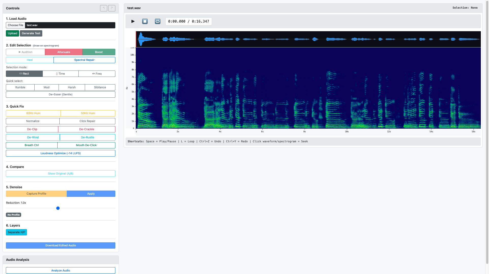

# SpectraMini

A lightweight spectral audio editor built with Python and Flask. Edit audio visually using a spectrogram interface - a free, open-source alternative for tasks typically handled by professional audio repair software.



## Features

### Spectral Editing
- **Visual spectrogram editing** - See and select frequencies visually
- **Waveform display** - Traditional waveform view synced with spectrogram
- **Selection modes** - Rectangle, Time-only, Frequency-only selections
- **Frequency presets** - Quick select Rumble, Mud, Harsh, Sibilance ranges

### Edit Tools
- **Attenuate** - Reduce volume of selected region
- **Boost** - Amplify selected region with soft clipping
- **Heal** - Interpolate selection from surrounding audio
- **Spectral Repair** - Advanced context-aware fill considering harmonics

### Quick Fix Tools
- **60Hz/50Hz Hum Removal** - Remove electrical hum + harmonics
- **Click Repair** - Detect and repair transient clicks
- **De-Clip** - Reconstruct clipped/distorted peaks
- **De-Crackle** - Remove vinyl/tape crackle
- **De-Wind** - Remove low-frequency wind rumble
- **De-Rustle** - Remove lavalier/clothing mic rustle
- **Breath Control** - Reduce breath sounds in vocals
- **Mouth De-Click** - Remove mouth clicks and lip smacks
- **Normalize** - Normalize to peak level
- **Loudness Optimize** - Target -14 LUFS (streaming standard)
- **De-Esser** - Gentle sibilance reduction

### Audio Processing
- **Noise Reduction** - Capture noise profile and apply reduction
- **HPSS Layers** - Separate harmonic and percussive components
- **A/B Compare** - Toggle between original and edited versions
- **Undo/Redo** - Full edit history

### General
- **Any audio format** - WAV, MP3, M4A, FLAC, OGG, etc.
- **Keyboard shortcuts** - Z/Y for undo/redo
- **Audition** - Preview selection with loop option
- **Click-to-seek** - Click waveform or spectrogram to set playhead

## Installation

### Prerequisites
- Python 3.8+
- ffmpeg (for non-WAV format support)

### Setup

1. Clone the repository:
```bash
git clone https://github.com/hamiltonbarber/SpectraMini.git
cd SpectraMini
```

2. Create a virtual environment (recommended):
```bash
python -m venv venv
source venv/bin/activate  # On Windows: venv\Scripts\activate
```

3. Install dependencies:
```bash
pip install -r requirements.txt
```

4. Run the app:
```bash
python app.py
```

5. Open your browser to:
```
http://localhost:5001
```

## Usage

1. **Load Audio** - Click "Choose File" or drag and drop an audio file
2. **Make Selection** - Click and drag on the spectrogram to select a region
3. **Edit** - Use the tools in the sidebar to process your selection
4. **Preview** - Click "Audition" to hear your selection
5. **Download** - Click "Download" to save your edited audio

### Keyboard Shortcuts
- `Z` - Undo
- `Y` - Redo

### Selection Modes
- **▭ Rect** - Standard rectangular selection
- **↕ Time** - Select full frequency range for a time region
- **↔ Freq** - Select full time range for a frequency band

## Requirements

```
flask
librosa
soundfile
numpy
scipy
```

## License

MIT License - feel free to use, modify, and distribute.

## Author

Hamilton Barber - [hamiltonbarber.com](https://www.hamiltonbarber.com)
